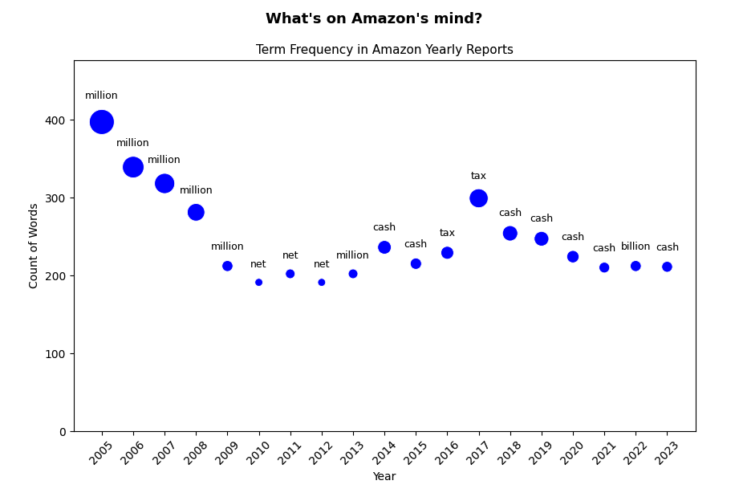

## Text Data from Amazon's Annual Reports

This is a TidyTuesday (and also a PydyTuesday) project! Check out the data source info here at the Tidy Tuesday GitHub repo: https://github.com/rfordatascience/tidytuesday/tree/main

Check out the notebook file pydytuesday_20250325.ipynb for code exploring the data and visualizing it with matplotlib and VADER.

### How to Participate

- [Explore the data](https://r4ds.hadley.nz/), watching out for interesting relationships. We would like to emphasize that you should not draw conclusions about **causation** in the data. There are various moderating variables that affect all data, many of which might not have been captured in these datasets. As such, our suggestion is to use the data provided to practice your data tidying and plotting techniques, and to consider for yourself what nuances might underlie these relationships.
- Create a visualization, a model, a [Quarto](https://quarto.org/) report, a [shiny app](https://shiny.posit.co/), or some other piece of data-science-related output, using R, Python, or another programming language.
- [Share your output and the code used to generate it](../../../sharing.md) on social media with the #TidyTuesday hashtag.
- [Submit your own dataset!](../../../.github/pr_instructions.md)  

### PydyTuesday: A Posit collaboration with TidyTuesday  

- Exploring the TidyTuesday data in Python?  Posit has some extra resources for you! Have you tried making a [Quarto dashboard](https://quarto.org/docs/dashboards/)? Find videos and other resources in [Posit's PydyTuesday repo](https://github.com/posit-dev/python-tidytuesday-challenge).
- Share your work with the world using the hashtags #TidyTuesday and #PydyTuesday so that Posit has the chance to highlight your work, too!
- Deploy or share your work however you want! If you'd like a super easy way to publish your work, give [Connect Cloud](https://connect.posit.cloud/) a try.

