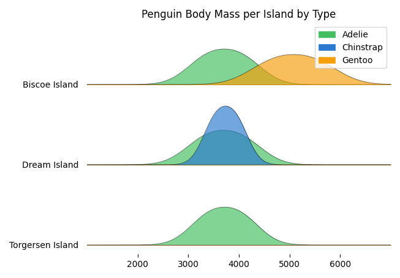

# Palmer's Penguin Data

This week I explored Palmer's penguin dataset and used the resulting visualization for both #TidyTuesday and for Day 15 of the #30DayChartChallenge. 



### Coding
Check out the penguin.py for visualization code. The following packages were used:

```python
import PyDyTuesday
import pandas as pd
import plotly.express as px
from joypy import joyplot
import numpy as np
import matplotlib.pyplot as plt
```
