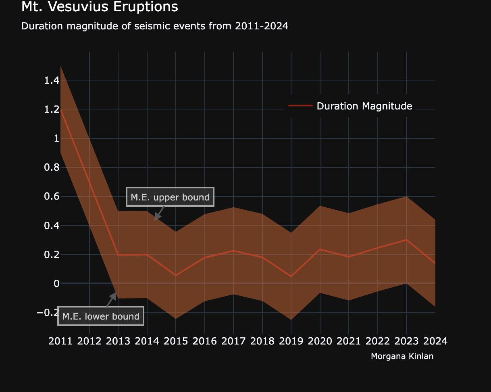

# Seismic Events

This week's [#TidyTuesday](https://github.com/rfordatascience/tidytuesday/blob/main/data/2025/2025-05-13/readme.md) data is Mt. Vesuvius eruptions, curated by Libby Heeren! 

I took the opportunity to learn more about how to use Plotly. In particular, the syntax for graphing objects, which I was unfamiliar with. 

I also struggled with (but eventually succeeded!) in creating text box annotations, which took far too long to position properly using code. 

Professional advice - if this is for work, save yourself 45 minutes and just copy the chart as an image, then add a text box in Powerpoint.

Sources: Data Science Learning Community (2025). Tidy Tuesday: A weekly social data project. https://tidytues.day
