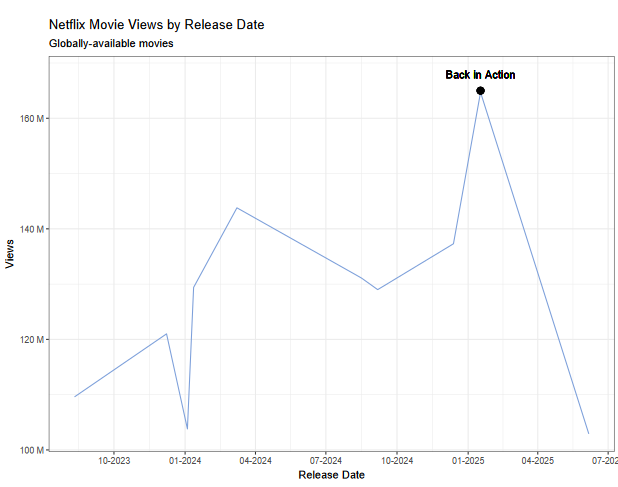

# What are we watching on Netflix?

This week's [#TidyTuesday](https://github.com/rfordatascience/tidytuesday/blob/main/data/2025/2025-07-29/readme.md) data is movies and shows on Netflix. 



See below code used to create it:

```r
pacman::p_load(readr,ggplot2,dplyr,scales) #scales package used for x and y axis re-formatting

movies <- readr::read_csv('https://raw.githubusercontent.com/rfordatascience/tidytuesday/main/data/2025/2025-07-29/movies.csv')

#filtering 

fav_movies<-movies %>% filter(available_globally=="Yes") %>% slice_max(n=10,order_by= views)

#initial plot
p<-ggplot(fav_movies, aes(x=release_date, y=views))+
    geom_line(color="#7C9FDA") +
    xlab("")

#do annotations first then change formatting of x and y axes or it's really confusing to label the annotation
p<-p + annotate(geom="text", x=as.Date("2025-01-17"),y=1.68e+8, label="Back in Action")+
    annotate(geom="point",x=as.Date("2025-01-17"),y=1.65e+8, size = 3)+
    scale_x_date(date_breaks="3 months",date_labels="%m-%Y") + 
    scale_y_continuous(labels =unit_format(unit="M", scale = 1e-6))+
    labs(
    title = "Netflix Movie Views by Release Date",
    subtitle = "Globally-available movies",
    caption = "",
    tag = "",
    x = "Release Date",
    y = "Views") +
        theme_bw()

#show plot
p   
