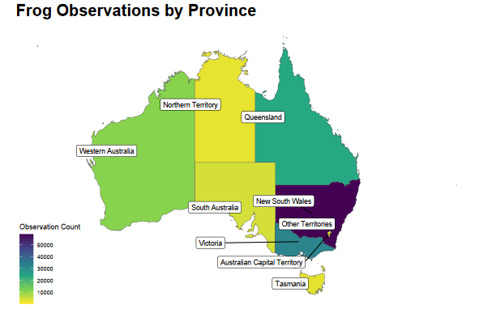

## Where the frog (observations) at?

This week's [#TidyTuesday](https://github.com/rfordatascience/tidytuesday/blob/main/data/2025/2025-09-02/readme.md) data is 
Australian frog data curated by Jessica Moore. This data is collected by citizen scientists throughout Australia, and is both informative, and adorable, because frogs. 

Thank you, Jessica, for curating, and to the citizen scientists of Australia for your efforts collecting this data!



```{r}
pacman::p_load(readr,ggplot2,dplyr, viridis,tidyr, ozmaps,sf)

frogID_data <- readr::read_csv('https://raw.githubusercontent.com/rfordatascience/tidytuesday/main/data/2025/2025-09-02/frogID_data.csv')
frog_names <- readr::read_csv('https://raw.githubusercontent.com/rfordatascience/tidytuesday/main/data/2025/2025-09-02/frog_names.csv')


# Chloropleth Map
frogs<-frogID_data %>% group_by(stateProvince) %>% summarize(occurrence_count=n())

#australia state map data
australia_states_map <- ozmap_data("states")

#join aggregated data with the map data
map_data_join <- australia_states_map %>% left_join(frogs, by = c("NAME" = "stateProvince"))

#viz
map_data_join %>% ggplot() +
  geom_sf(aes(fill=occurrence_count)) + #using the 'geometry column', which has polygon data
  ggsflabel::geom_sf_label_repel(aes(label = NAME),size = 3, force = 50, nudge_x = -2, seed = 10) +
  scale_fill_viridis_c(option = "viridis", direction = -1) + # color gradient
  labs(title = "Frog Observations by Province",
       fill = "Observation Count") +
  theme_map()+
  theme(
    plot.title = element_text(size = 20, face = "bold")
  )

```

